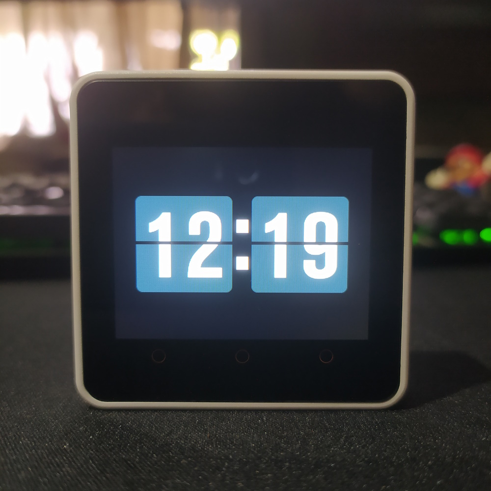

# FlipClock


FlipClock is an aesthetic digital clock for M5Stack, which recreates the behavior of a vintage flip clock with a modern, clean and minimalist design.




### Important

Before you can start uploading the sketch to your M5Stack, you will need to make some changes to the **config.h** file.

* Modify the following two variables with your network credentials so that M5Stack can connect to an existing network.

```
const char* ssid       = "YOUR_SSID";
const char* password   = "YOUR_PASS";
```

* Adjust the UTC offset for your time zone (in seconds). See [list of UTC time offsets](https://en.wikipedia.org/wiki/List_of_UTC_offsets). Here are some examples for other time zones:
    * For UTC -3.00: -3 * 60 * 60: -10800
    * For UTC +1,00: 1 * 60 * 60: 3600
    * For UTC +0,00: 0 * 60* 60: 0

```
const long  gmtOffset_sec = 3600;
```

* Change daylight offset (in seconds). Set it to 3600 if your country follows daylight saving time; otherwise, set it to 0.

```
const int   daylightOffset_sec = 3600;
```
